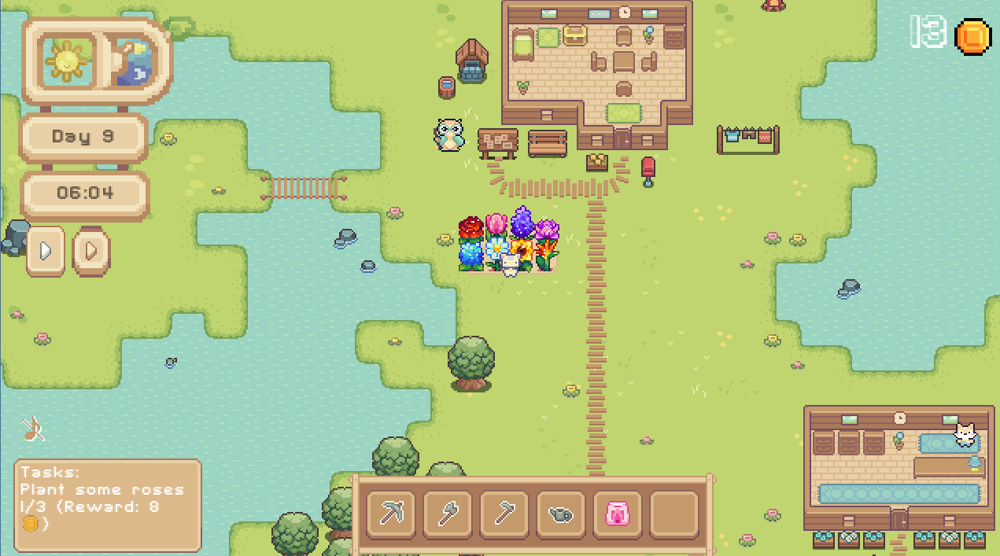

# 🌸 Bloomrise

**Bloomrise** is a cozy 2D **farming life-sim game** developed in **Godot Engine 4**. You play as a gardening cat who cultivates flowers, gathers resources, sells crops, and manages inventory in a peaceful open world with a dynamic weather system and daily cycle.



**Repository:** [https://github.com/Ellemire/Bloomrise](https://github.com/Ellemire/Bloomrise)

---

## Gameplay Overview

In **Bloomrise**, you:

- Explore the world as a cat gardener
- Plant, water, grow, and harvest flowers
- Use tools such as a hoe, pickaxe, axe, and watering can
- Collect natural resources (e.g., wood, stones)
- Buy and sell items in the in-game shop
- Manage your inventory and storage chest
- Build and expand your flower garden at your own pace

---

## Core Game Systems

### State Machine

The player character uses a state machine system to separate logic into clear behaviors:

- **Idle**, **Walk**
- **Tool actions**: Mining, Chopping, Watering, Tilling

This makes the code modular, clean, and easy to expand.

### Time & Weather System

- Each in-game day lasts **1440 virtual minutes**
- Weather changes daily: **sunny**, **cloudy**, or **rainy**
- Rain automatically waters crops

### Plant Growth System

- Crops grow through **4 stages**
- Plants require watering (by player or rain) to progress
- Once mature, plants can be harvested and sold

### World Interaction

The player can:

- Destroy trees and rocks for resources
- Till soil and plant flowers
- Water, harvest, and sell crops
- Interact with UI, shop, and storage systems

### Inventory System

- 4x3 item slot grid with drag & drop
- Separate **Tools Panel** with 6 quick-access slots
- Items can be moved, dropped, or stored in a **chest**

### Shop System

- Features two tabs: **Buy** and **Sell**
- Players can buy seeds and sell harvested flowers
- Full UI interaction with item preview and pricing

### Tutorial (Intro Dialogue)

- Game starts with a **tutorial** guided by a wise owl named **Wisowl**
- The player is introduced to mechanics: harvesting, planting, inventory use, and the shop

---

## Project Structure (Godot)

```
Bloomrise/
├── Assets/               # Sprites, sounds, animations
├── Dialogues/           # Tutorial dialogue files
├── Inventory/           # Inventory and tools UI logic
├── Scenes/              # Main scenes (world, player, UI, etc.)
│   ├── Characters/
│   ├── Houses/
│   ├── Level/
│   └── UI/
├── Scripts/             # GDScript code
│   ├── State machine/
│   ├── Globals/
├── Tilesets/            # World tilesets
└── project.godot        # Godot project file
```

---

## How to run the Game

1. **Clone the repository:**

```bash
git clone https://github.com/Ellemire/Bloomrise
cd Bloomrise
```

2. **Open the project in [Godot Engine 4.0+](https://godotengine.org/download)**

3. **Press `F5` or click "Run Project" to start playing**

---

## Technologies Used

- **Godot Engine 4.0+**
- **GDScript**
- Modular game architecture
- Custom UI systems
- Pixel art & animations

---

## Authors

- **Patrycja Smits** (272940)
- **Julia Krok** (272981)

Developed as a final project for **Game Programming and Design** at **Wrocław University of Science and Technology**.
